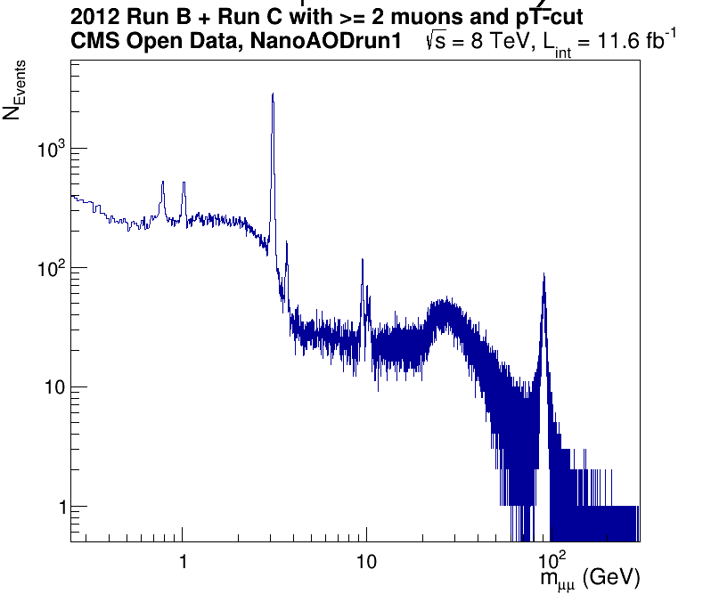
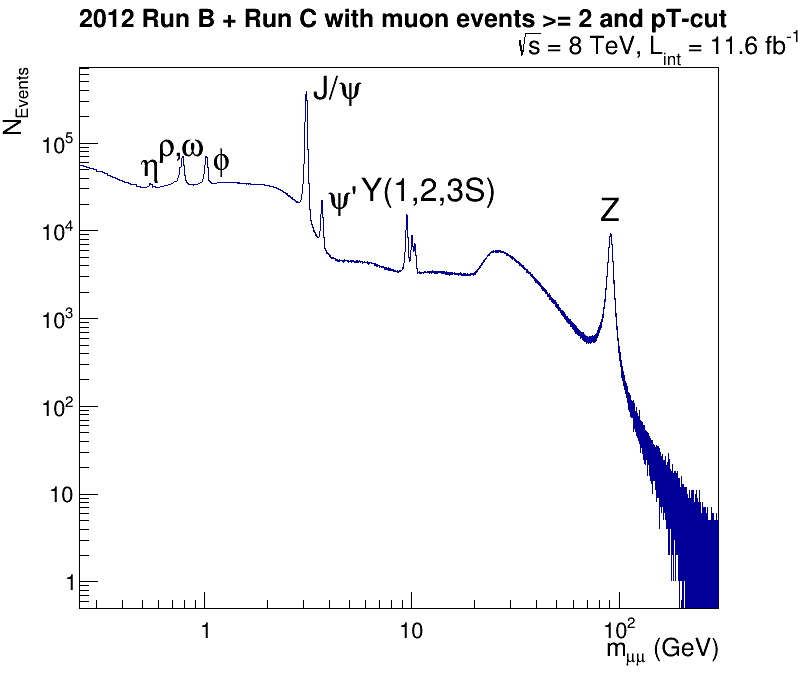
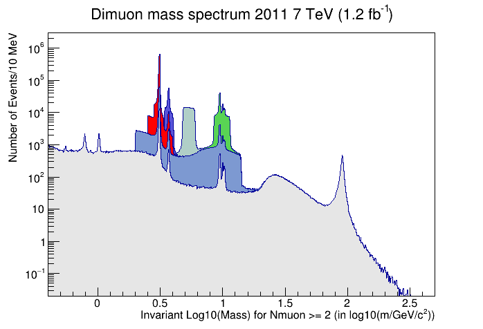

# Analyzying the dimuon samples

This lesson will be primarily following the material found [here](https://twiki.cern.ch/twiki/bin/view/CMSPublic/NanoAODRun1Examples)
about using the NanoAOD format in an analysis of the dimuon samples.

> ## Potential pitfalls!
> We'll be running over some larger ROOT files in this lesson and for some of you, memory issues may cause some errors
> or crashes of the code. If that happens, it is primarily restricted to this exercise and you should feel free to simply 
> follow along with the instructor. 
{: .callout}

## Download the code and scripts

Launch your Docker container, as per the previous episode.
From inside your Docker container, we're going to execute a series of `curl` commands. 
[`curl`](https://curl.se/) is a widely used utility to download files from remote locations. 
Simply highlight the commands below and cut-and-paste them into your Docker terminal, or your
local terminal if you are working without Docker. 

~~~
curl https://twiki.cern.ch/twiki/pub/CMSPublic/NanoAODRun1Examples/Dimuon2011_eospublic.C  --output Dimuon2011_eospublic.C  
curl https://twiki.cern.ch/twiki/pub/CMSPublic/NanoAODRun1Examples/Dimuon2011_eospublic_RDF.C --output  Dimuon2011_eospublic_RDF.C 
curl https://twiki.cern.ch/twiki/pub/CMSPublic/NanoAODRun1Examples/Dimuon2011_local.C --output  Dimuon2011_local.C 
curl https://twiki.cern.ch/twiki/pub/CMSPublic/NanoAODRun1Examples/Dimuon2011_local_RDF.C --output  Dimuon2011_local_RDF.C 
curl https://twiki.cern.ch/twiki/pub/CMSPublic/NanoAODRun1Examples/MuHistos_eospublic.cxx --output  MuHistos_eospublic.cxx 
curl https://twiki.cern.ch/twiki/pub/CMSPublic/NanoAODRun1Examples/MuHistos_local.cxx --output  MuHistos_local.cxx 
curl https://twiki.cern.ch/twiki/pub/CMSPublic/NanoAODRun1Examples/dimuonSpectrum2012_eospublic.C --output  dimuonSpectrum2012_eospublic.C 
curl https://twiki.cern.ch/twiki/pub/CMSPublic/NanoAODRun1Examples/dimuonSpectrum2012_eospublic_test.C --output  dimuonSpectrum2012_eospublic_test.C 
curl https://twiki.cern.ch/twiki/pub/CMSPublic/NanoAODRun1Examples/dimuonSpectrum2012_eospublic.py.txt --output  dimuonSpectrum2012_eospublic.py 
curl https://twiki.cern.ch/twiki/pub/CMSPublic/NanoAODRun1Examples/dimuonSpectrum2012_local.C  --output dimuonSpectrum2012_local.C  
curl https://twiki.cern.ch/twiki/pub/CMSPublic/NanoAODRun1Examples/dimuonSpectrum2012_local.py.txt --output dimuonSpectrum2012_local.py 
curl https://twiki.cern.ch/twiki/pub/CMSPublic/NanoAODRun1Examples/dimuonSpectrum2012_outreach.C   --output dimuonSpectrum2012_outreach.C   
curl https://twiki.cern.ch/twiki/pub/CMSPublic/NanoAODRun1Examples/dimuonSpectrum2012_outreach.py.txt  --output dimuonSpectrum2012_outreach.py  
~~~
{: .language-bash}

You can look to see that the files were downloaded properly by typing

~~~
ls -ltr
~~~
{: .language-bash}

## Run some of the commands

Your instructor will be executing most of these commands, some of which might take a few minutes to run. 

In most cases, these scripts produce an output `.pdf` file with a name similar to that of the script itself. 
If you have any issues with ROOT displaying the plots as they are made, you can view the `.pdf` files 
on your *local* system by looking in the `cms_open_data_run1` directory that you created. 

### Zeroth example 

The first thing we will do is run a very simple ROOT script that loads in a single, relatively small
file from CERN and produces a plot of the dimuon spectrum. Because it is a single file, 
we will not have the same amount of data in this plot as later examples, but you can 
use this to check your connection and X windows forwarding (e.g. does the plot pop up?).

To run simple example, you will launch ROOT with the name of the script as an argument. 

~~~
root -l dimuonSpectrum2012_eospublic_test.C
~~~
{:. language-bash}

It should take less than one minute to run and if it does, you will see a window pop up that looks like
the following image. 

> ## CMS dimuon spectrum - 2012 data sample
> Invariant mass of a select sample of oppositely charged dimuon pairs.
> Derived from a smaller subset of 2012 data.
> 
{: .solution}

If you are having issues with X11 forwarding, the script should still create a file 
`dimuonSpectrum2012_C_eospublic.pdf` in the `cms_open_data_run1` directory you made, 
and you can view it there. 

> ## Running over more 2012 data. 
> If you wanted to run this same script over more of the
> 2012 data, you would want to edit this section of `dimuonSpectrum2012_eospublic_test.C`.
> 
> ~~~
> 
>     // Create dataframe from NanoAODEun1 files on eospublic
>     // Larger files - run over this to see the full statistics
>     //ROOT::RDataFrame df("Events", {"root://eospublic.cern.ch//eos/opendata/cms/upload/NanoAODRun1/01-Jul-22/Run2012B_DoubleMuParked_merged.root", "root://eospublic.cern.ch//eos/opendata/cms/upload/NanoAODRun1/01-Jul-22/Run2012C_DoubleMuParked_merged.root"});
> 
>     // Smaller file - use this for testing your connection as it should take less than 1 minute to run
>     ROOT::RDataFrame df("Events", "root://eospublic.cern.ch//eos/opendata/cms/upload/NanoAODRun1/01-Jul-22/Run2012B_DoubleMuParked/01-Jul-22Run2012B_DoubleMuParked/03C5684F-8BAF-4312-8235-2B0039F2FB93.root");
>     // RDataFrame interfaces to TTree and TChain. The "Events" part makes sure that within the root file, the data frame is taken from within the "Events" folder.
> 
> ~~~
> {: .language-cpp}
> 
> When you download the script, the line `ROOT::RDataFrame df("Events", "root://eospublic.cern.ch//eos/opendata/cms/upload/NanoAODRun1/01-Jul-22/Run2012B_DoubleMuParked/01-Jul-22Run2012B_DoubleMuParked/03C5684F-8BAF-4312-8235-2B0039F2FB93.root");` is uncommented, and that defines the single file that the script runs over. 
> 
> Just above it, you will see the line `//ROOT::RDataFrame df("Events", {"root://eospublic.cern.ch//eos/opendata/cms/upload/NanoAODRun1/01-Jul-22/Run2012B_DoubleMuParked_merged.root", "root://eospublic.cern.ch//eos/opendata/cms/upload/NanoAODRun1/01-Jul-22/Run2012C_DoubleMuParked_merged.root"});`. This tells the script to read in the two files (`../Run2012B_DoubleMuParked_merged.root` and `../Run2012C_DoubleMuParked_merged.root`), but this line is *commented* due to the double slashes `//` at the beginning of the line. 
> If you want to run over these larger files on your own time, you can uncomment that line (delete the two slashes) and comment out the other line. So after
> making those edits, this part of the script would look like this. 
> 
> ~~~
> 
>     // Create dataframe from NanoAODEun1 files on eospublic
>     // Larger files - run over this to see the full statistics
>     ROOT::RDataFrame df("Events", {"root://eospublic.cern.ch//eos/opendata/cms/upload/NanoAODRun1/01-Jul-22/Run2012B_DoubleMuParked_merged.root", "root://eospublic.cern.ch//eos/opendata/cms/upload/NanoAODRun1/01-Jul-22/Run2012C_DoubleMuParked_merged.root"});
> 
>     // Smaller file - use this for testing your connection as it should take less than 1 minute to run
>     //ROOT::RDataFrame df("Events", "root://eospublic.cern.ch//eos/opendata/cms/upload/NanoAODRun1/01-Jul-22/Run2012B_DoubleMuParked/01-Jul-22Run2012B_DoubleMuParked/03C5684F-8BAF-4312-8235-2B0039F2FB93.root");
>     // RDataFrame interfaces to TTree and TChain. The "Events" part makes sure that within the root file, the data frame is taken from within the "Events" folder.
> 
> ~~~
> {: .language-cpp}
{: .callout}

In the following sections, the scripts are written so as to run over larger files. Depending on your connection, 
it may take longer than the time alotted for this activity during the workshop, in which case you
are encouraged to follow along with the instructor and run these on your own time, if you so choose. 

### First example 

Let's run the first command making use of ROOT's ability to compile and execute a file in one step. 
This might take 5 minutes for local participants at CERN, but longer for remote participants. 

~~~
root -l MuHistos_eospublic.cxx++ 
~~~
{: .language-bash}

~~~
root [0]
Processing MuHistos_eospublic.cxx++...
Info in <TUnixSystem::ACLiC>: creating shared library /code/./MuHistos_eospublic_cxx.so
reading root://eospublic.cern.ch//eos/opendata/cms/upload/NanoAODRun1/01-Jul-22/Run2010B_Mu_merged.root
writing to MuHistos_Mu_eospublic.root
entries = 26718043
event nr 0
event nr 1000000
event nr 2000000
event nr 3000000
event nr 4000000
event nr 5000000
event nr 6000000
event nr 7000000
event nr 8000000
event nr 9000000
event nr 10000000
event nr 11000000
event nr 12000000
event nr 13000000
event nr 14000000
event nr 15000000
event nr 16000000
event nr 17000000
event nr 18000000
event nr 19000000
event nr 20000000
event nr 21000000
event nr 22000000
event nr 23000000
event nr 24000000
event nr 25000000
event nr 26000000
~~~
{: .output}

After the above output, the program will finish and will return the command-line prompt. 
The program should have produced an output file called `MuHistos_Mu_eospublic.root`. You can check this by typing

~~~
ls -l MuHistos_Mu_eospublic.root
~~~
{: .language-bash}

~~~
-rw-r--r-- 1 cmsusr cmsusr 31625 Jul 31 22:57 MuHistos_Mu_eospublic.root
~~~
{: .output}

You can open this file in ROOT and inspect it with a `TBrowser`. First type

~~~
root -l MuHistos_Mu_eospublic.root
~~~
{: .language-bash}

This will put you into the ROOT environment, from which you can then launch the `TBrowser`
from the prompt (you needn't type the `root [0]`). 

~~~
root [0] TBrowser b;
~~~
{: .code}

You can then click on the file name in the window and then click on the various 
histograms to view them.

## Example 2 (`RDataFrame`)

A different example runs over a smaller (2 Gb) file, primarily used for
outreach, and makes use of ROOT's relatively 
newer `RDataFrame` object. You can run this example by launching ROOT from the commandline.

~~~
root -l dimuonSpectrum2012_outreach.C
~~~
{: .language-bash}

It should only take a few minutes to run and if X-forwarding is working for you, you 
should see a ROOT window pop up that looks like this.

> ## CMS dimuon spectrum
> Invariant mass of a select sample of oppositely charged dimuon pairs.
> 
{: .solution}

## Example 3 (2011 data)

This example runs over 2011 data that was used for more "real" analysis. 
Takes about 15 minutes at CERN.

~~~
root -l Dimuon2011_eospublic_RDF.C
~~~
{: .language-bash}

When it finishes, it should pop up a window with the following plot. 

> ## CMS dimuon spectrum - 2011 data sample
> Invariant mass of a select sample of oppositely charged dimuon pairs.
> Derived from 2011 data.
> 
{: .solution}

